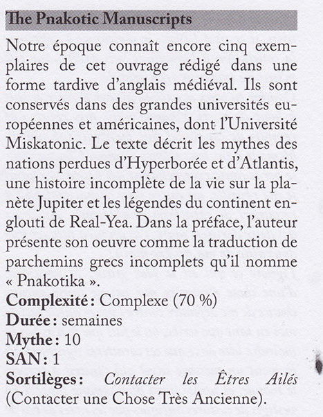
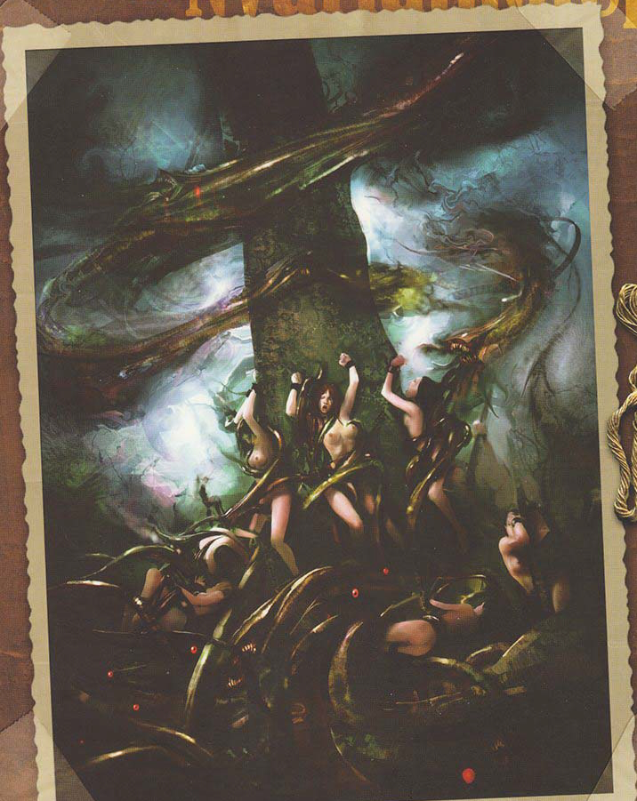

# 10 février 2023

#TODO ouvrir la caisse dans le navire
#TODO aller a shanghai
#TODO aller en egypte en premier
#TODO retourner voir [[James Barrington]] et [[mickey mahonay]] 

nous sommes le 7 février, descente de police dans les docks, ca trouve de la drogue, des armes, des explosifs, des trucs du culte

On peut lire le livre [[Pnakotiques]], ca parle d'antartique “in Terra Australis or the Anti-powds” et Ulthara, Mount Hatikala, and the Sea of Cerenarae. [[lance de Neth]]

  

  

  

  

dans le journal 
The Penhew Foundation announces with regret that its esteemed director, Mr. [[Edward Gavigan]] , will be taking an extended leave of absence due to health reasons. During his absence, the duties of director will be performed by the Assistant Director, Mr. Thomas
Cardwell. - The Times of London

on va chez [[Edward Gavigan]] on trouve des boutons de manchettes du [[golden ???]] 

on va sur la route, suivre un camion jusqu'à une route [[misr]] c'est de l'egyptien 

dans une cave secrete, on trouve des équipements de tortures et caché :   

#TODO volé un livre d'occultisme en arabe, a traduire
on trouve aussi un nom écrit en latin : Ego serviam ei

on trouve des registres #TODO voir les registres dans roll 20 "Registre Gavigan LON02"; ca bug pour enregistrer 

#TODO aller inculper Audrey
  

chien de tindalos

  

  

je suis frappé de [[Stupeur: Stats -8, INT-12, Social -60, skills -60%. Incapable tant que pas reçu philo-20% / psycha. Def-25%]]