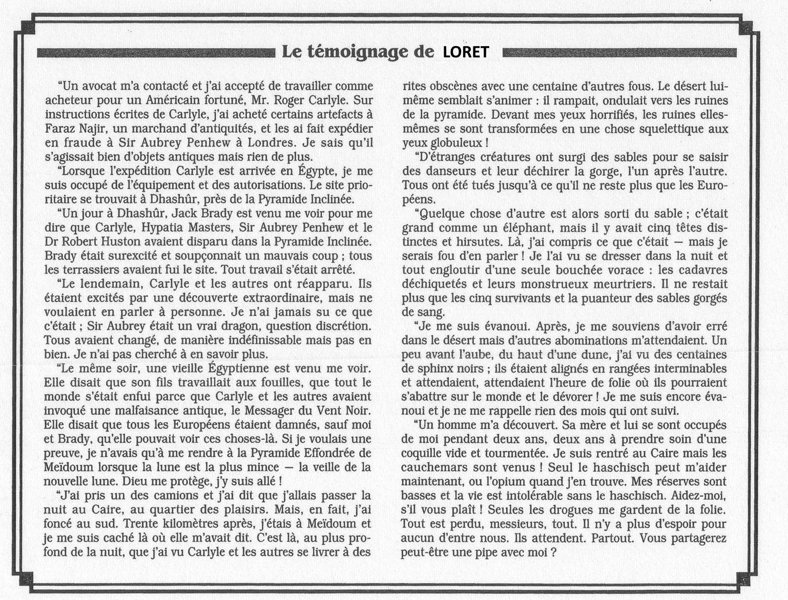
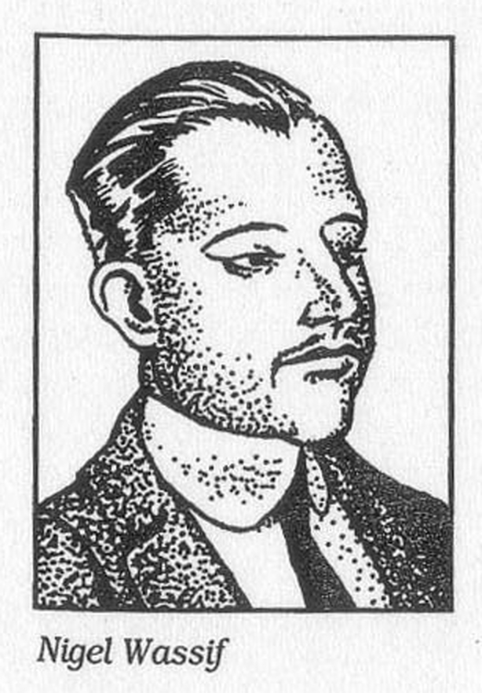
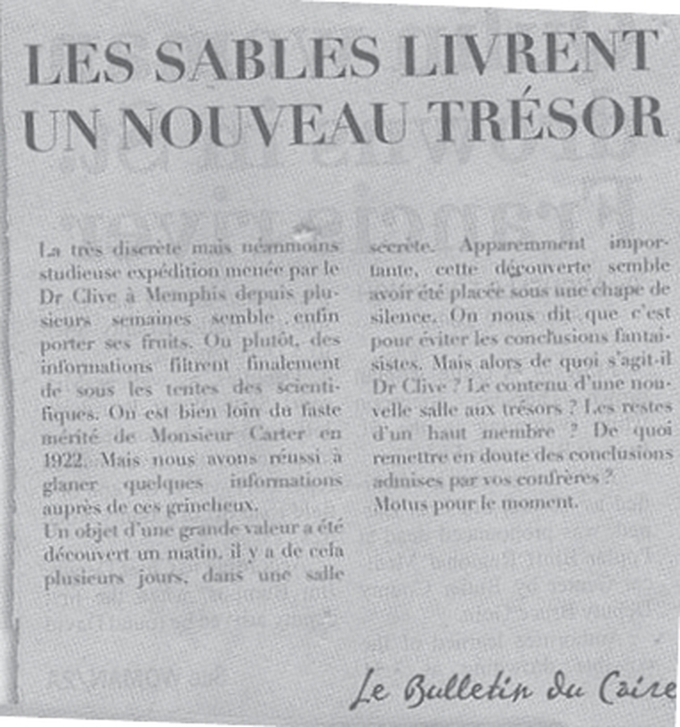
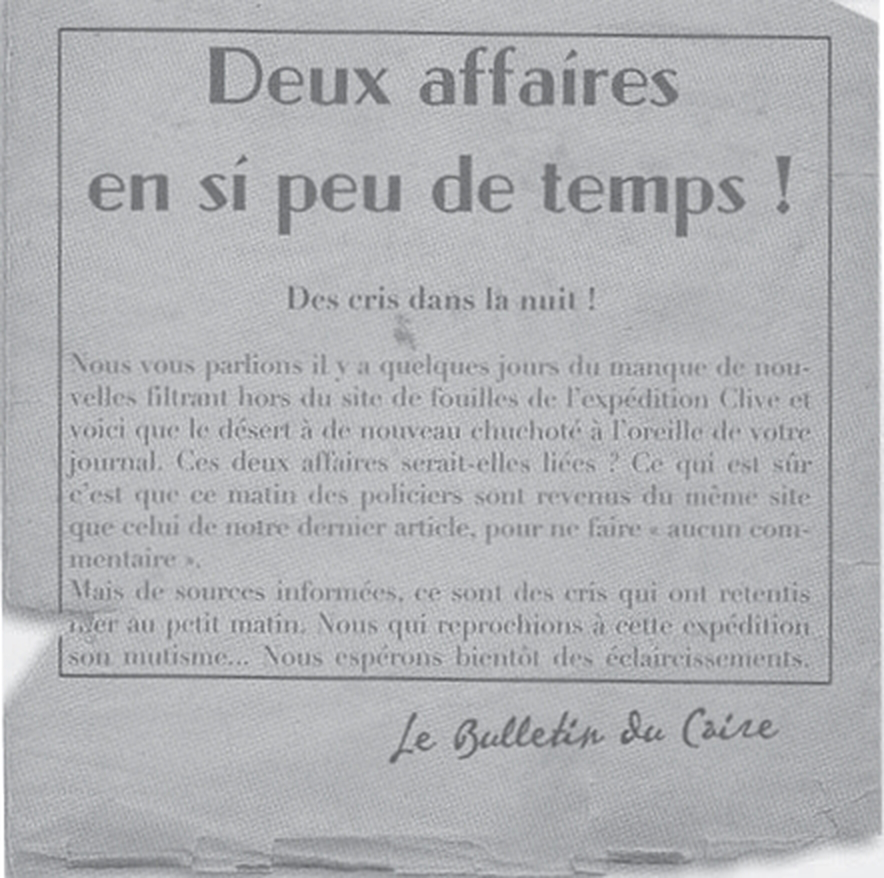
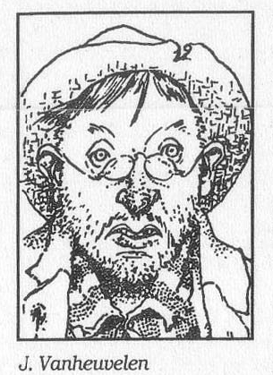
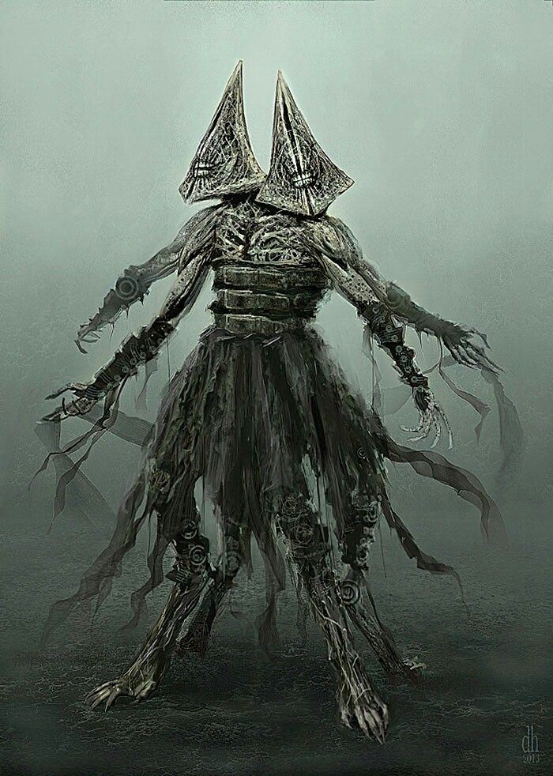
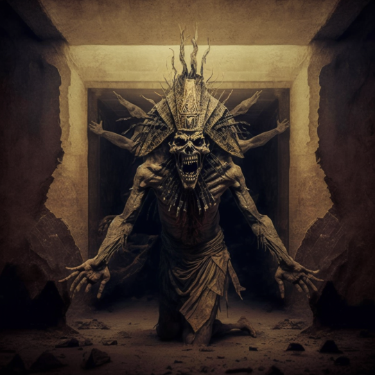

# 10 mars 2023

[[TODO]] on peut aller [[#cité des morts]] ou [[#pyramides]]

  

on est au caire le 9 mars, a chercher [[Faraz nagir]]

rendez vous à 13h à la [[mosquée El Oussen]]

il nous dit que c'est la meme fondation qui finance l'expedition [[Clyve]]  que l'expedition [[Carlyle]]. Il nosu dit que [[Carlyle]] cherchait des infos sur la [[fraternité du pharaon noir]], [[Auguste Loret]] . Il a vendu des papyrus decrivant l'entrée d'une chambre secrete et un tambour magique, un serre tete avec un zircon. 

la [[fraternité du pharaon noir]] est accusé d'encore exister et prévoit de voler des objets a la mosquée de [[Ibn Tulun]]. Il nous dit de ne pas aller voler [[Omar Shakti]].

[[pyramide inclinée]] à #Dhashur

on se fait agresser dans la mosquée. on sauve [[Faraz nagir]] mais qui part se cacher.

on va au journal pour en savoir plus sur l'expedition [[Clyve]], le journal nous dit daller aux archives en attendant de rencontrer [[Nigel Wassif]]

   

on trouve des photos ou un employé est toujours sur différentes photos, de différentes époques. ca indique que [[Carlyle]] est malade, mais s'en vont au #Kenya à #moubassa en mai 1919

[[Nigel Wassif]] nous montre  
  

il nous dit qu'un membre de l'expedition [[Clyve]] s'est fait dégagé : [[Vanheuvelen]] #TODO le trouver, dans le vieux caire? ou on peu picoler

il nous parle aussi de [[Omar Shakti]], [[Clyve]] est payé par la [[fondation penhew]], il font des fouilles à #Gisey dans la pyramide de [[mykelinos]] ou ils ont trouvés une momie, la reine [[myktoris]]. mais la momie a disparue. il ne faut pas faire confiance à la police.

il nous donne l'adresse de la plantation de [[Omar Shakti]]. 

on trouve [[Vanheuvelen]] dans un bar, on le ramene au [[shepheard]] 

  
il nous parle de [[Johanes Sprech]] et [[Agatha Broadmoor]]. il s'est fait sortir avant de partir pour #memphis

il nous parle de la déesse des chats [[Bastet]] et [[Sebekh]] dieu crocodile

des pierres moustachues #TODO qu'est ce que c'est ?

il faut faire un rituel au sostice d'été pour summon [[nyarlatotep]] devant les pyramides

2 jours plus tard on le retrouve sanguignolant mais encore vivant, agressé par des chats.

accueilli a la pyramide par [[Winfield]] 

on dit qu'on est venu via [[Edward Gavigan]] et son marchand d'épices. excuses: on lui dit que [[Vanheuvelen]] parlait de [[Clyve]], on lui ramene pour eviter qu'il ne parle trop

2 flics ont disparus sans laisser de traces

[[Agatha Broadmoor]] a prevenu [[Clyve]] qu'il ne fallait pas qu'on sois là.
on se fait dégager. Donc on cherche des bouches d'aératio nde la pyramide

il va vers le #sphynx et la pyramide

  

que je tu avec un 29 !!!! Remington  Double barrel  1920 que j'appelle "tueur de sphinx" #arme

  

