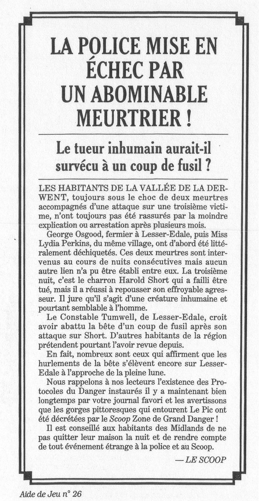
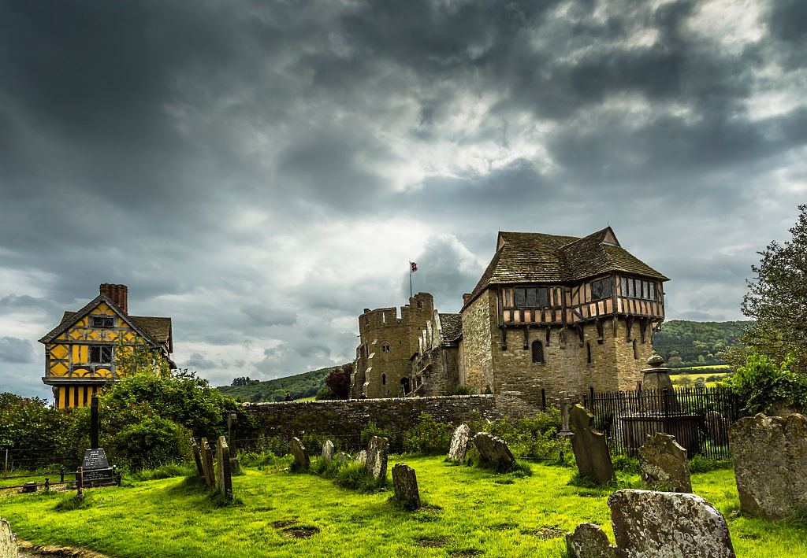
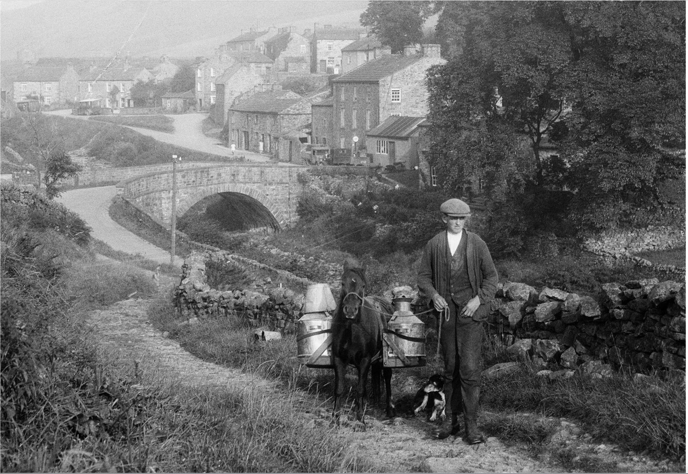
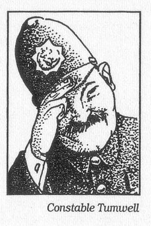
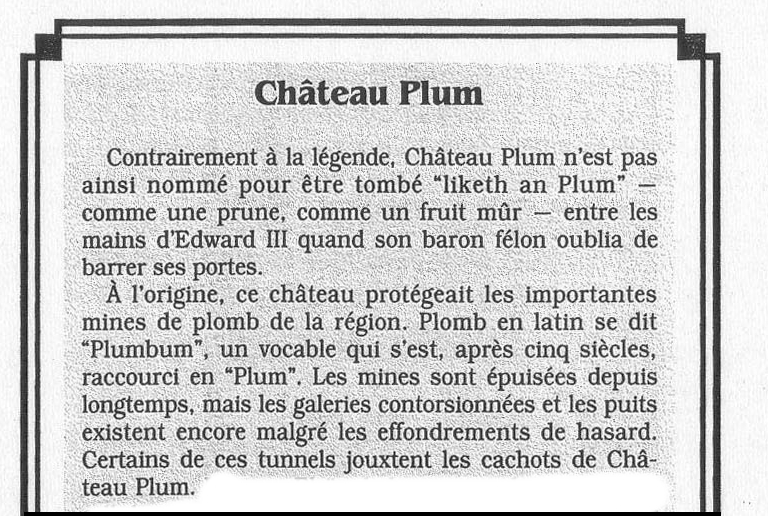
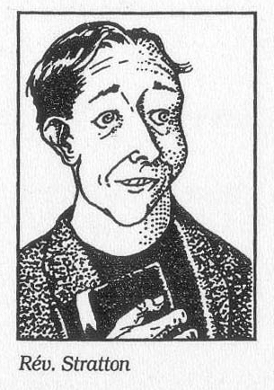
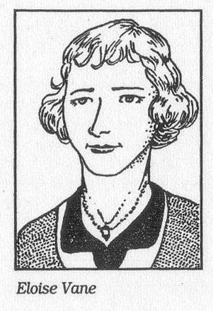

  

Monstre à #lesser-Easdale
[[George Osgood]] mort
[[Lydia Perkins]] mort
[[Harold Short]] 
[[Tumwell]]

[[chateau Plum]]
  

  
on arrive a #lesser-Easdale
il y a un pub, le [[cheval hilare]]

on rencontre le constable [[Tumwell]]   

ALLONS voir le curée qui est un druide

[[Tom]]
[[Lawrence Vane]] petit fils de [[Sir Fredrick Vane]] : propriétaire du chateau. [[Eloise Vane]] 

[[père Perkins]] 

  

[[reverand Stratton]]
  

  

[[Evangeline Vane]] a tuer des gens pour sorcelerie

[[Emilia Fantano]]

#TODO aller voir l'inspecteur de scotland yard [[James Barrington]] 