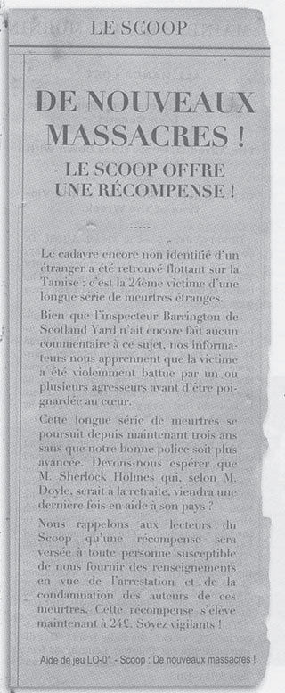
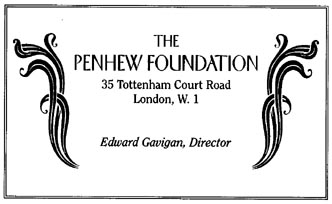

# 10 février 2026

arrivé à #londres

  

[[James Barrington]]  [[Sherlock Holmes]] [[Edward Gavigan]]

Nous devons aller voir aller voir [[inspecteur James Barrington]] et [[mickey mahonay]] à #londres #TODO

  

Nous allons [[scoop]] voir [[mickey mahonay]], qui nous donne les 3 titres suivants:
- [[Monstre du Derbyshire]] #TODO
- [[Massacre à Soho]] #TODO
- [[Un serpent à Soho]] #TODO

on paye quelquun pour se renseigner sur les livres ci dessus #TODO 

des égyptiens sont tués poignardés au coeur

on va à la fondatoin [[Aubrey Penhew ]] pour rencontrer [[Edward Gavigan]]

il nous parle d'une jeune femme noire [[anastasia]] qui est allé avec [[Hipatya masteuse]] en safari au #Kenya ils s'y ont perdu. Il nous parle du site de #Dhashur en #egypte et des sites secondaires près des pyramides

[[Edward Gavigan]] ne semble pas honnete

#Caire #Dashou #Gisey

il appelle un assassin pour tuer  [[Jonas Kensington]] du [[prospero press]]  après notre départ

le long des sarcophage de l'expo il ya des sillons => ils sont ouvert 

il y a de l'eau et de l'électricité qui vont dans le sous sol #TODO

[[Edward Gavigan]] va dans une boutique d'épice sur [[Harbour street]] #TODO il faut qu'on aille visiter

on retourne a la fondation à la fondatoin [[Aubrey Penhew ]] par effraction on trouve une entrée dans un sarcophage

on trouve une statue de [[cthulhu]] et un texte indiquant [[nyarlatotep]]

photo du bureau de [[Aubrey Penhew ]]

on trouve une adresse sur des caisses : [[Ho Fong Imports]] ,15 Kaoyang Road Shangai #shangai, Chine en anglais-chinois
et aussi: Adressée [[Cie maritime Randolph]] , Port #Darwin, #Australie. Mr Randolph Personnel