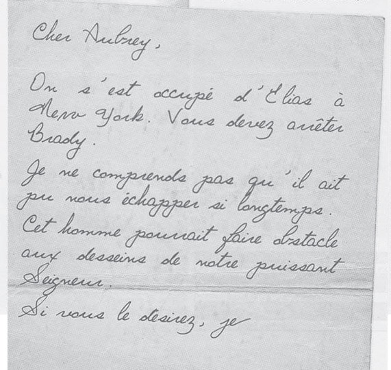
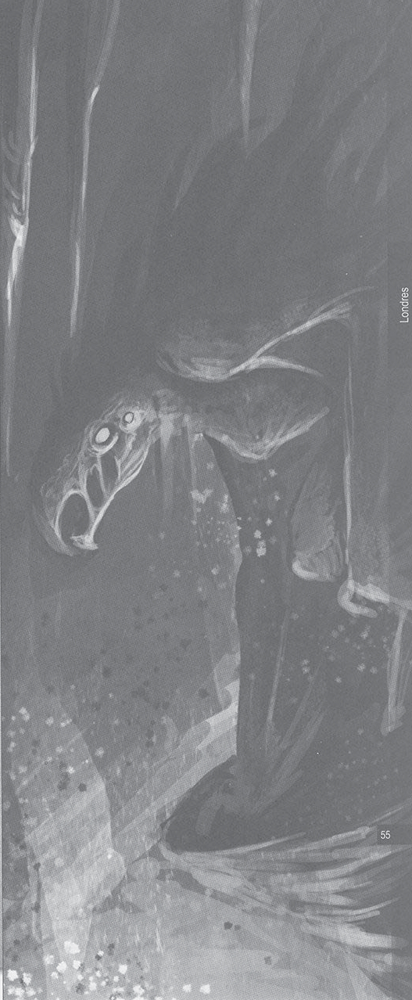
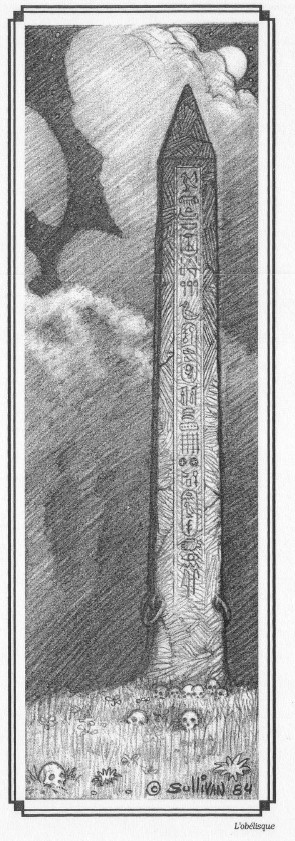
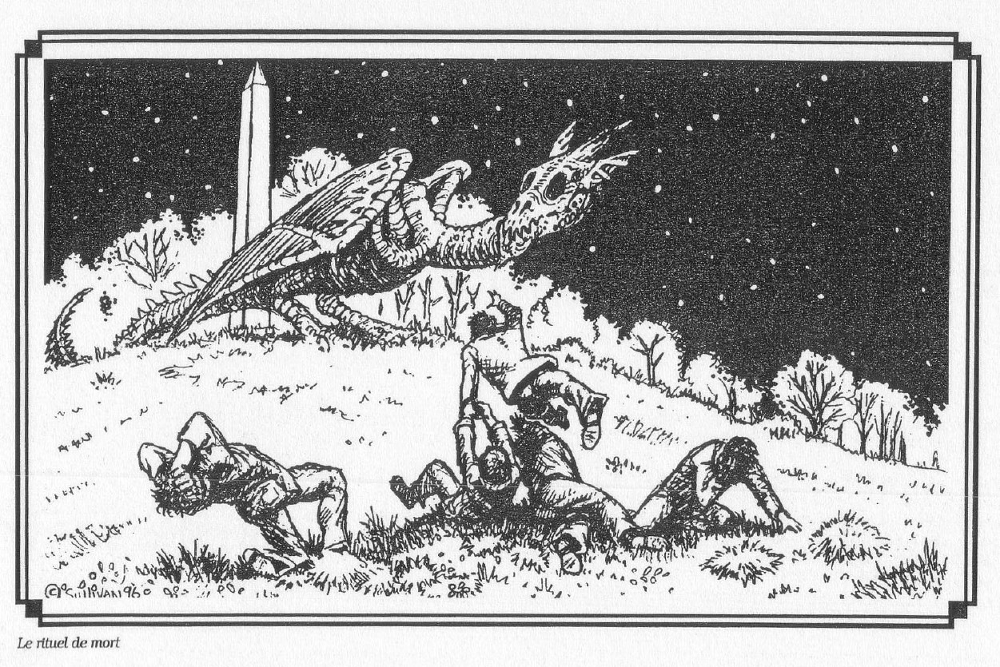
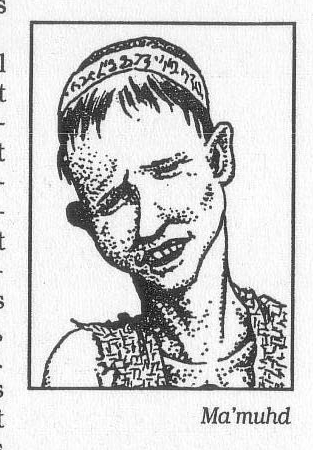
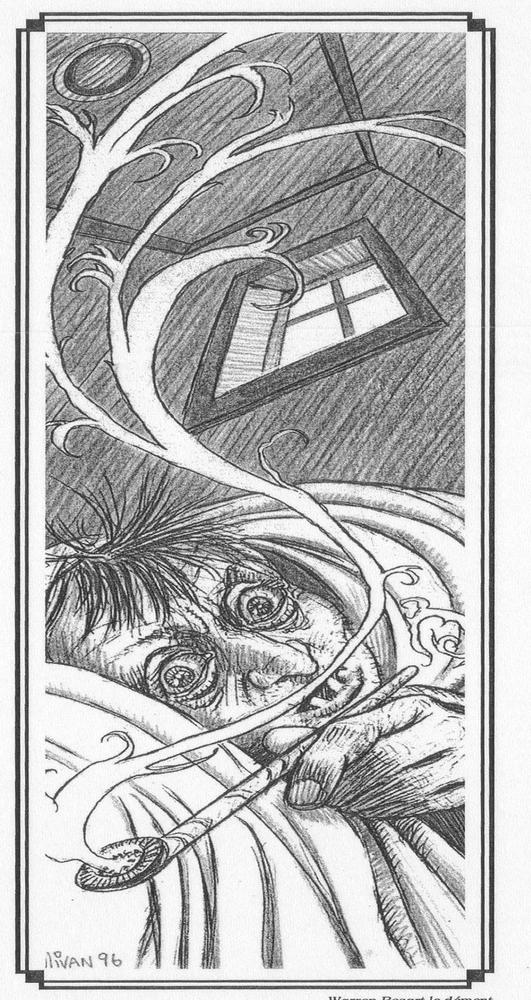
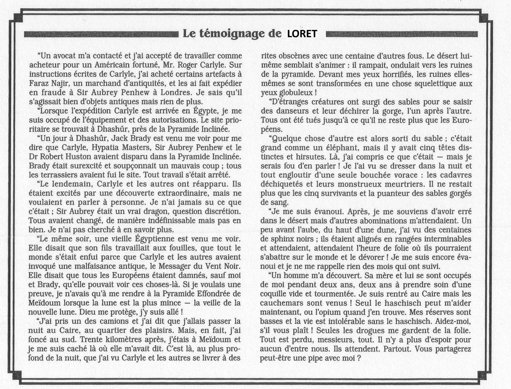
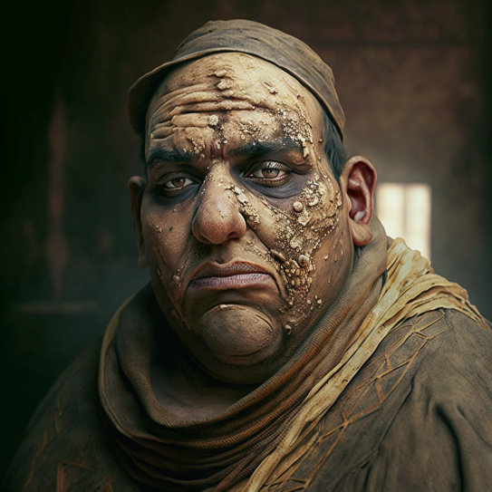

stuart Devlin est sous stupeur je prend le controle de [[Inspecteur James McCormick]]

[[Jackson Elias]] [[jack Brady]]
  

il y a des sectateurs dans la plaines 

et des #shantak   
autour de l'obélisque 
  

  

 on monte dans le  [[vent d'ivoire]]

on suit le capitaine du bateau a la [[fondation penhew]]
il rentre dans une auto avec quelqu'un

on trouve dans le coffre du bateau des valves et bobines. je vole une valve

on prend un bateau pour l'égypte. un bateau geant nous suit

on arrive a #alexandrie le 4 mars.

je vais au [[Thomas cook and son]] hotel avec Sylvain

nous allons voir [[Auguste Loret]] et [[Faraz nagir]] au Caire

l'expedition [[Carlyle]] a du trouver un représentant pour faire des recherches archeologiques

on va a la poste en esperant trouver une adresse pour [[Auguste Loret]]. Il vit a la [[porte rouge]] sur l'allée des scorpions.

on va a l'hotel [[shepheard]]

notre traducteur   

on trouve [[Auguste Loret]]
  

[à lire]
  

[[ity del ouasta]]

il faut aller chercher au marché [[marché kanel kanili]]

on y va pour [[Faraz nagir]] qui s'enfuit 
  

[[TODO]]
on peut aller [[#cité des morts]] ou [[#pyramides]]

