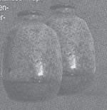
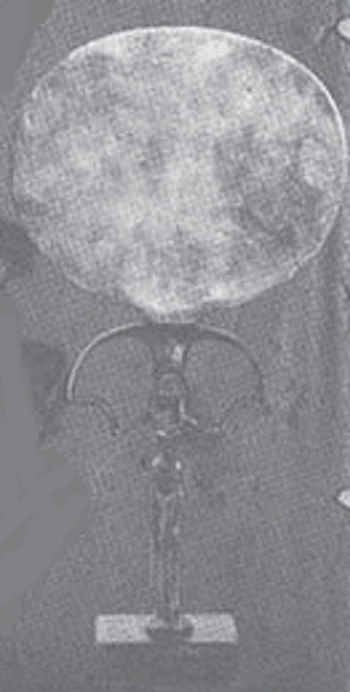
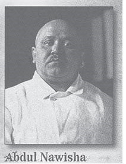
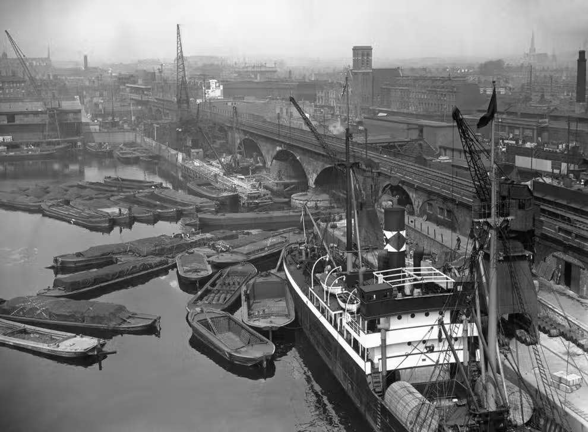
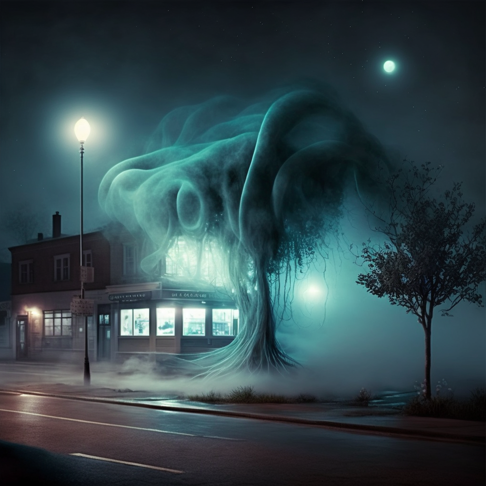
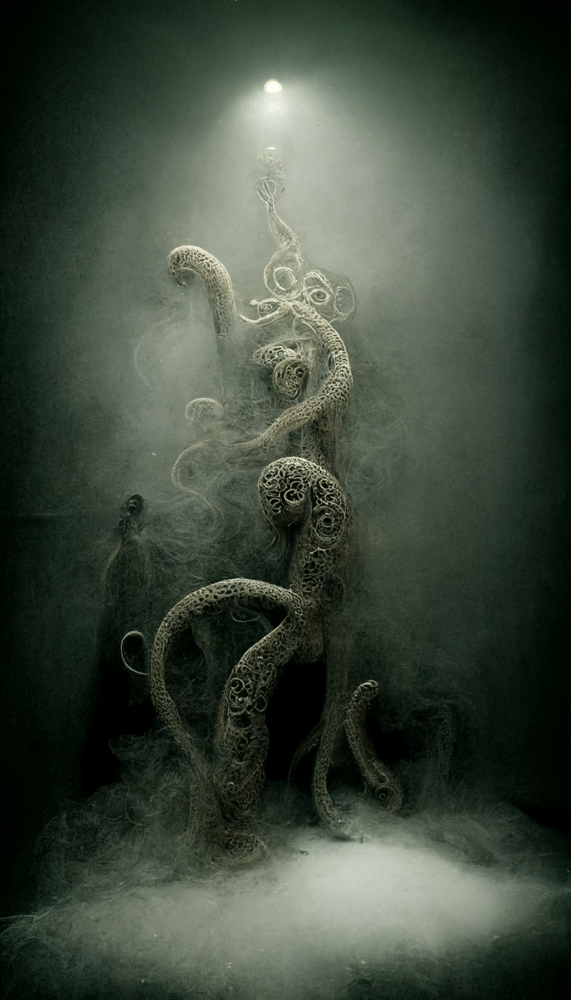

# 27 janvier 2023

on va voir [[James Barrington]]  à #scotlandyard sur #broadway

il nous dit : que [[Jackson Elias]] croyais les meutres des égyptiens étaient fait par la [[fraternité du pharaon noir]] 

Toutes les visites ont été battue a mort par des arme contendantes, et un coup de poignard au coeur

une victime a créé "Othep" qui eux dire "paie" ou "repos"

les victimes fréquentaient le club egyptien [[la pyramide bleue]]

son collegue  a enquété pendant 2 ans a disparu

on va a la boutique d'épices [[empire spices]] sur [[Harbour street]] il y a 2 guetteurs arabiques. Il y a un [[Tewfik Al Sayed]]  qui est le vendeur

on trouve des fioles   
et un papyrus verni et un [[miroir de gal]]   on détruit le miroir et on se fait taper dessus en sortant

En revenant a notre hotel, une lettre avec des photos du mari de Jac attaché et meurti. 

nous allons à la [[la pyramide bleue]]

[[Abdul Nawisha]]

  

une fille dit à un de nous que quelqu'un a enlevé son petit ami [[Samir]] tous les mois un camion vient prendre une 12aine d'egyptien

un enfant de 6-7 ans arrive au club et fait fuir des clients , u ndes clients est tetanisé quand le gamin le regarde. 
le gamin dit qu'[[Edward Gavigan]] l'a envoyé pour surveiller le propriétaire [[Abdul Nawisha]]

en sortant du club on voit un camion de la [[fondation penhew]] qui va dans un entrepot dans un coin lugubre des docks et qui descende une caisse

  

un des gards des docks appel un [[punji]]

la caisse est monté sur le bateau [[vent d'ivoire]] immatriculé 

capitaine [[lars torvak]] un norvegien, on monte sur son bateau et on trouve [[15 kaion road shangai]] chez [[Ho Fong Imports]]

en repartant on est attaqu;e par 

  

  

#TODO ouvrir la caisse dans le navire
#TODO aller a shanghai

#TODO retourner voir le flic? journaliste?
