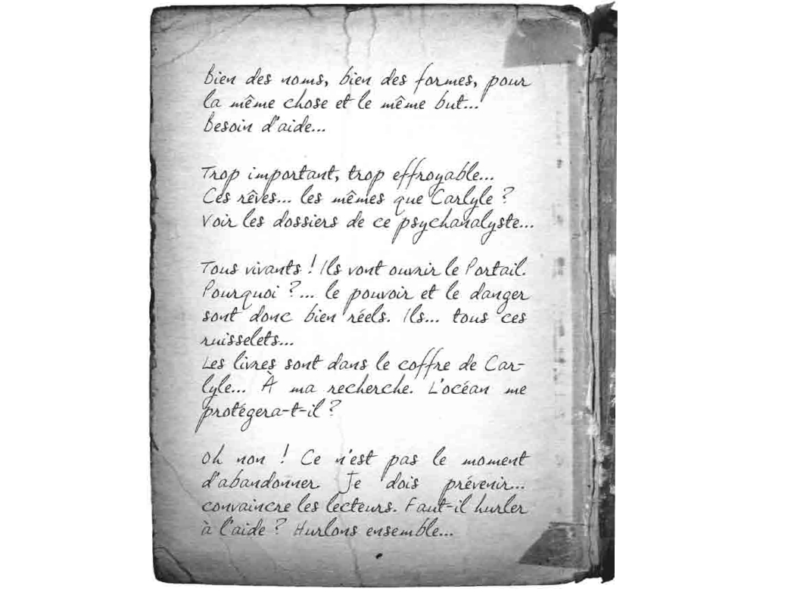
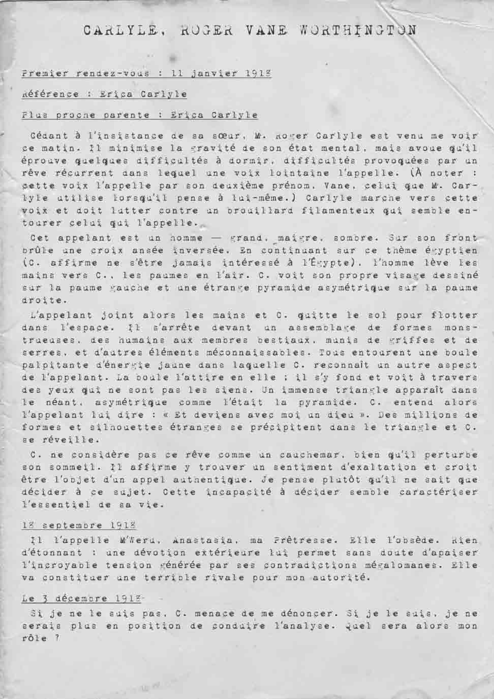
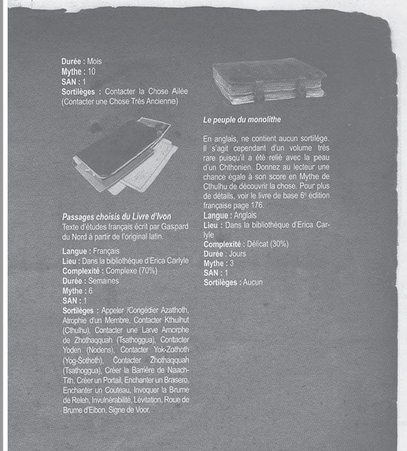
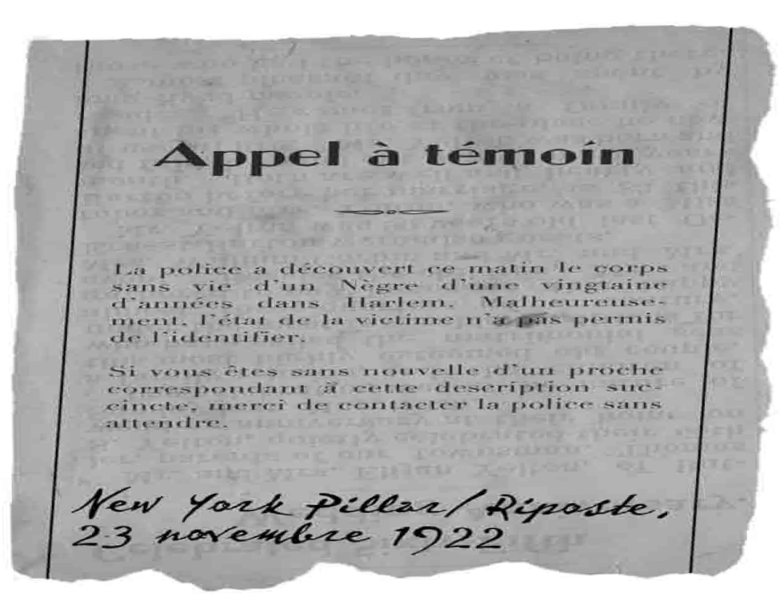
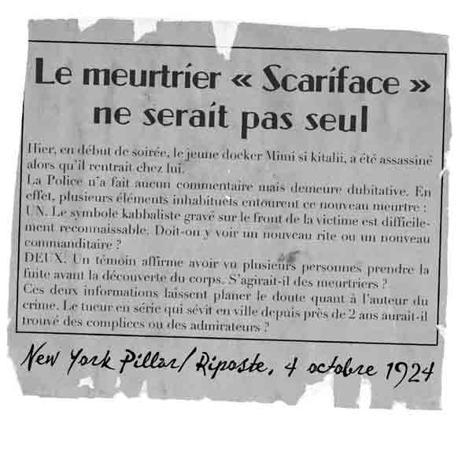
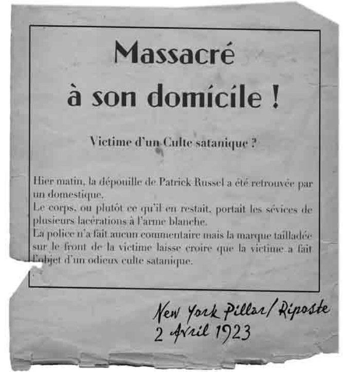
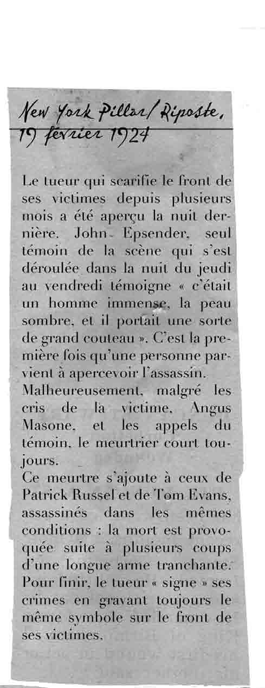
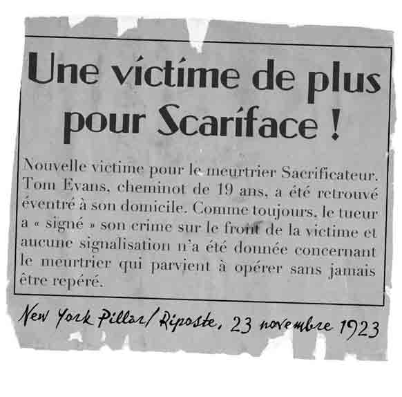
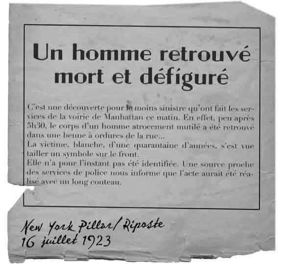

# 4 novembre 2022

22 janvier 1925

[[Jonas Kensington]] nous donne   qui parle des coffres de [[Carlyle]], ca parle de #portail  et du docteur [[Robert Huston]]

une partie du groupe va rencontrer le docteur [[docteur schefield]] pour accéder au dossier de [[Carlyle]] 

on retourne voir  [[Victoria Post]] à sa gallerie, ouverte cette fois ci.
elle va exposer le 22 janvier a la maison [[Carlyle]]

on rappel [[Miriam Atwright]] pour la marque sur le front, nous dit que la marque est utilisé par un culte africain tribal :  [[culte de la langue sanglante]]
elle nous dit que [[Jackson Elias]] avait une petite amie ??? #TODO 

dossier médicaux de [[Erica Carlyle]] : le médecin chargait 90$ de l'heure. préoccupé par son frère 
dossier médicaux de [[Roger Carlyle]] écrit par [[Robert Huston]] :   #egypte  [[M'weru]] 

on arrive a rentrer dans la soirée au manoir [[Carlyle]] on fouille un peu, alex trouve une photo prise à #londres
[[Erica Carlyle]] nous parle d'une negresse reine et de contacts : [[Horrace Starret]] #TODO au #Kenya et [[Auguste Loret]] #TODO au #Caire et on trouve les manuscrits:
Manuscrits [[Pnakotiques]] #TODO anglais #objets => moi
[[Peuple Monolithe]] #TODO anglais #objets => jass
[[Vie d'un dieu]] #TODO  #objets => Alex
Passages choisi text étude / [[Livre d'Ivon]] #TODO francais => Corinne #objets
  

on a un appel de [[Martin Poole]] et on va au commissariat, débordé par ses enquêtes
  
  
  
  
  
  
on a carte blanche pour trouver les assassins #TODO l'appeler pour qu'il sache quand frapper, il amenera 10 hommes

j'ai des visions qu'on noir recupere les victimes des assassinats du cultes, il se coupe se fai saigner met le sang dans la bouche des cadavres les embrasse  et les cadavres se relevent.

on decide de retourner à la boutique [[juju]] et on se fait attaquer par des animaux : guepes/chevre/babouin/python/fourmis

aller interroger les voisins et les soudoyer pour avoir des infos #TODO