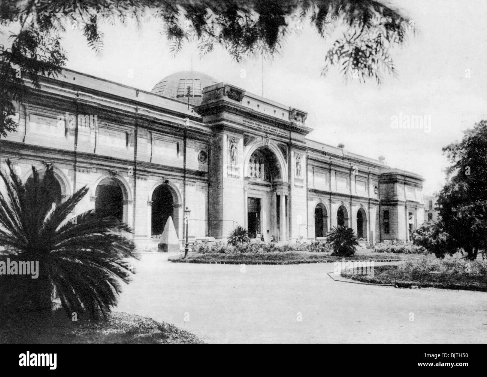

[[Hakim]] remplace [[Mahmoud]]

[[Nerris]] vient nous voir a l'hotel

on recoit une note de [[Nigel Wassif]]  qui nous dit d áller voir le docteur [[Ali kafour]] 
#TODO aller voir [[Ali kafour]]

on va a la plantation de coton de [[Omar Shakti]]
on rencontre des fellahs (paysan), qui plantent du cotons 
ils portent ce tatouage  #symbole

villa de [[Omar Shakti]] 

chat de Omar 

on va a la mosquée [[Ibn Tulun]] ou on rencontre [[Nessim Efti]] [[Ahmed Zeravi]] en echange dun rituel il nous enmene a usous sol, ou il y a une ceinture millenaire qui a appartenu a la reine [[Niktoris]], il faut aussi la couronne et le collier
  

ils nous redirigent vers le docteur [[Ali kafour]]  au [[musée du caire]]

[[Nefrouka]] qui vient de [[Hirem]] #Hirem la [[cité des piliers]] sa position est dans le [[necronomicon]] ecrit par [[Alhazraid]].  [[snefrou]] met fin a la 3eme dynastie et execute [[Nefrouka]].

la 1ere pyramide est à #medum [[Medum]] mais elle est tombée
2eme est à [[Dhashur]] #Dhashur dans la [[pyramide inclinée]]

le pharaon noir est [[nyarlatotep]] 

[[culte de la langue sanglante]]

dans la villa de [[Omar Shakti]] de nuit, quand il n'est pas là.

 [[Aubrey Penhew ]]

on va au village #elwasta voir  [[Nyiti d'el Wasta]]

on trouve un fragment rose/rouge qui vient de la pyramide de medum, à la [[pyramide rouge]] 

#TODO La confrérie va se rencontrer à #Gisey le lendemain sous les pyramides, entre les pates du sphynx

on retourne a l'hotel, on est attendu par un gros felin noir, qui en est après Corinne, elle doit aller redonner les parchemins

on recoit une benedictions de bastet +1 POU +1 APP 

#rituels les 9 vies de [[Bastet]] 6hr, série gestes à 4 pattes / sol ak du sang chien TAI 2 min recuilli ds calice d'or pur à pleine lune en insultant Bedou et ses fils. INTx2, 1 Pou, 2d3 HP sous inconscience X 9 vies),

alex m'agresse pendant la nuit et me montre l'abyme de [[Nodenn]] seigneur de l'abyme.
il y a un carosse celeste porté par 2 pleiosaures. dans le carosse un homme agé aux cheveux blancs. il va affronter les forces du mythes. le dieu exterieur. j'ai 25 % de chances de le contacter !

#TODO
comment expulser les grands anciens => nyarlatotep , impossible

#TODO pour detruire la ceinture de [[Niktoris]] nous devons posseder un couteau permettant d'invoquer les vagabonds dimensionnels 
#TODO enfoncer le couteau dans l'orbite de l'oeil gauche des revenants-mort vivant pour ls détruire
#TODO pour trouver le couteau nous devons regarder dans les grimoires

la haute maison dans la brume.
#TODO

cunnigam - Alex a était très cool 

