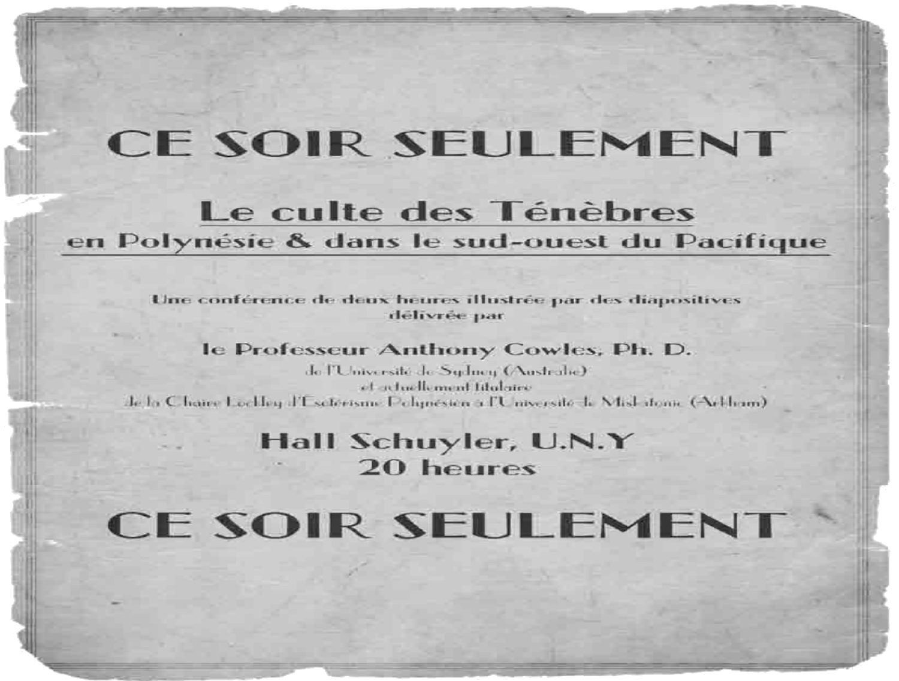
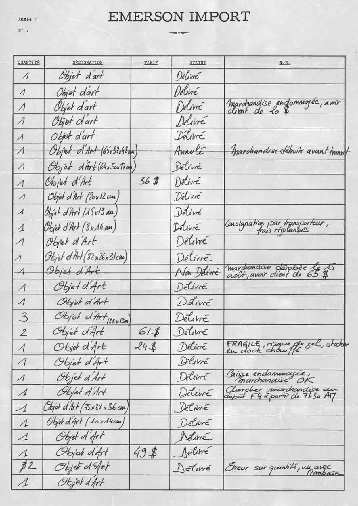

# Intro 7 Octobre 2022

## 15 janvier 1925

[[Jackson Elias]] a besoin de nous

![Liste des livres de [[Jackson Elias]]](images/20221007211356.png) [[pero press]] #pero press #Thug #NewYork
  

![[[Roger Carlyle]]](images/20221007211943.png)  #newyorkpillar #newyorkrepost
#fondation Penhew
accompagne [[Roger Carlyle]]:

- [[Aubrey Penhew ]]
- [[Robert Huston]]
- [[Hypathia Masters]]
- [[jack Brady]]

[[hotel Waldorf-Astoria]]
![[[Roger Carlyle]]](images/20221007211800.png)  [[Roger Carlyle]] #newyorkpillar #newyorkrepost

  
[[Mombasa]]
[[Royston whittingdon]]

[[Erica Carlyle]] [[Kikuyu]]
  

  

Nous allons retrouver [[Jackson Elias]] à l'hotel sur la 37eme chambre 410
attaqué par 3 sauvages 
planque toi dans [[harlem]], apporte "ca" au [[juju]]
culte australien [[Azatoth]]
servir de repas au [[shakotah]]

s'en vont à bord d'une voiture Hudson grise modele 1915, fabriqué à [[Detroit]] plaque NYL7

[[Jackson Elias]] a été éventré, et il a une marque au front  #marque  

nico a trouvé une bagne en bois #objets

convoqué par le lieutenant [[Martin Poole]], il y a des crimes depuis 3 ans.
[[Thomas  witerspoon]]  [[rue lenox]] à manhattan proprietaire de la voiture hudson, il sest fait voler la voiture

Trouvé près de [[Jackson Elias]]
  
[[Harvis]]

chiffoné dans la main d'un des tueurs [[Aubrey Penhew]] [[Edward Gavigan]]
  

[[Shangai]] [[stumbling tiger bar]]
  #shangai

  [[Emerson import]]
a l'endo de la carte:   [[Silas N'Kwane]]

photo de [[jonque ????OIRE]] avec un yach

[[Miriam Atwright]] [[pero press]]
  
Elle va regarder pour la marque sur le front #TODO

[[Anthony Cowles]]
  

[[Arthur Emerson]]
 

Nous allons a [[Emerson importme]] , mais [[Arthur Emerson]] n'y est jamais, alex l'appelle au téléphone, sans rien donner

on va aux entreprots directement et o ntrouve les livres de comptes:
  
  
potentiellement à échange à [[Martin Poole]]

